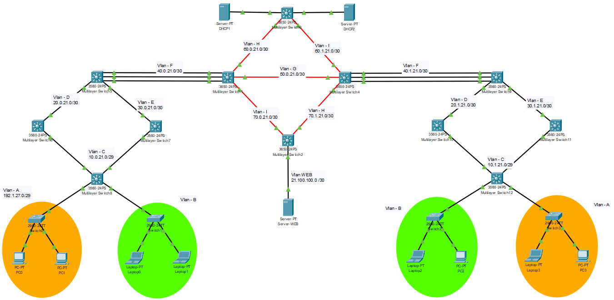
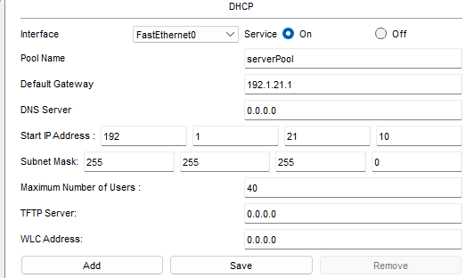
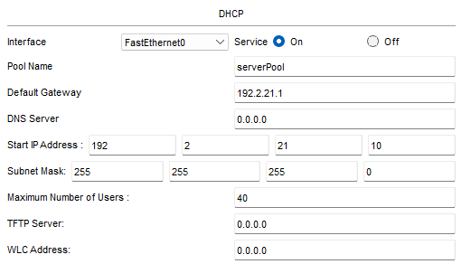

### **Universidad San Carlos de Guatemala**
### **Facultad de Ingeniería**
### **Escuela de Ciencias y Sistemas**
### **Redes de Computadoras 2**
### **Catedrático: Ing. Allan Alberto Morataya Gómez**
### **Auxiliar: Eduardo Ixén**

## **Manual Técnico - Proyecto 1**

- **Estuardo Gabriel Son Mux – 202003894**
- **Angel Eduardo Marroquín Canizales – 202003959**
-----------
## Topología


## Capa de Distribucion

``` CMD
ena
config t 

! Configuracion de vlans
vlan 100
name A
vlan 200
name B
vlan 10
name C
exit

! Configuracion de VTP
vtp mode server
vtp domain grupo21
vtp password grupo21
vtp version 2

! Configuracion de enlaces troncales
int range f0/1-2
switchport mode trunk
switchport trunk encapsulation dot1q
switchport trunk allowed vlan 100,200
exit

! Configuracion de interfaz vlan
int vlan 10
ip add 10.#.21.4 255.255.255.248
! Para la asignacion de IP por DHCP
ip helper-address 192.#.21.2
no shutdown

! Configuracion de interfaz de acceso
int f0/11
switchport mode access
switchport access vlan 10
exit

int f0/10
switchport mode access
switchport access vlan 10
exit
```

## Switches HSRP (IZQ)

``` CMD
ena
config t

! Configuracion de vlans
vlan 10
name C
vlan 20
name D

! Configuracion de HSRP
int vlan 10
ip add 10.#.21.2 255.255.255.248
! Para la asignacion de IP por DHCP
ip helper-address 192.#.21.2
no shutdown
standby version 2
standby 10 ip 10.#.21.1
standby 10 preempt
exit

! Configuracion de interfaz vlan
int vlan 20
ip add 20.#.21.1 255.255.255.252
! Para la asignacion de IP por DHCP
ip helper-address 192.#.21.2
no shutdown

! Configuracion de interfaz de acceso
int f0/11
switchport mode access
switchport access vlan 10
exit

int f0/12
switchport mode access
switchport access vlan 20
exit
```

## Switches HSRP (DER)

``` CMD
ena
config t

! Configuracion de vlans
vlan 10
name C
vlan 30
name E

! Configuracion de HSRP
int vlan 10
ip add 10.#.21.3 255.255.255.248
! Para la asignacion de IP por DHCP
ip helper-address 192.#.21.2
no shutdown
standby version 2
standby 10 ip 10.#.21.1

! Configuracion de interfaz vlan
int vlan 30
ip add 30.#.21.1 255.255.255.252
! Para la asignacion de IP por DHCP
ip helper-address 192.#.21.2
no shutdown

! Configuracion de interfaz de acceso
int f0/10
switchport mode access
switchport access vlan 10
exit

int f0/9
switchport mode access
switchport access vlan 30
exit
```

## LACP Red de Edificios

``` CMD
ena
config t

! Configuracion de vlans
vlan 20
name D
vlan 30
name E
vlan 40
name F

! Configuracion de LACP
int range f0/1-3
channel-group 1 mode active
no shutdown
exit

! Configuracion de interfaz po1
int po1
switchport mode access
switchport access vlan 40
exit

! Configuracion de interfaz de acceso
int f0/12
switchport mode access
switchport access vlan 20
exit

int f0/9
switchport mode access
switchport access vlan 30
exit

! Configuracion de interfaz vlan
int vlan 40
ip add 40.#.21.1 255.255.255.252
! Para la asignacion de IP por DHCP
ip helper-address 192.#.21.2
no shutdown
exit

int vlan 20
ip add 20.#.21.2 255.255.255.252
! Para la asignacion de IP por DHCP
ip helper-address 192.#.21.2
no shutdown
exit

int vlan 30
ip add 30.#.21.2 255.255.255.252
! Para la asignacion de IP por DHCP
ip helper-address 192.#.21.2
no shutdown
exit
```

## SW Edificios (IZQ)

``` CMD
ena
config t

! Configuracion de vlans
vlan 40
name F
vlan 50
name G
vlan 60
name H
vlan 70
name I

! Configuracion de LACP
int range Gig1/0/1-3
channel-group 1 mode active
no shutdown
exit

! Configuracion de interfaz de acceso
int range Gig1/1/2
switchport mode access
switchport access vlan 60
exit

int range Gig1/1/3
switchport mode access
switchport access vlan 50
exit

int range Gig1/1/1
switchport mode access
switchport access vlan 70
exit

! Configuracion de interfaz po1
int po1
switchport mode access
switchport access vlan 40
exit

! Configuracion de interfaz vlan
int vlan 40
ip add 40.0.21.2 255.255.255.252
! Para la asignacion de IP por DHCP
ip helper-address 192.#.21.2
no shutdown
exit

int vlan 50
ip add 50.0.21.1 255.255.255.252
! Para la asignacion de IP por DHCP
ip helper-address 192.#.21.2
no shutdown
exit

int vlan 60
ip add 60.0.21.1 255.255.255.252
! Para la asignacion de IP por DHCP
ip helper-address 192.#.21.2
no shutdown
exit

int vlan 70
ip add 70.0.21.1 255.255.255.252
! Para la asignacion de IP por DHCP
ip helper-address 192.#.21.2
no shutdown
exit
```

## SW Edificios (DER)

``` CMD
ena
config t

! Configuracion de vlans
vlan 40
name F
vlan 50
name G
vlan 61
name I
vlan 71
name H

! Configuracion de LACP
int range Gig1/0/1-3
channel-group 1 mode active
no shutdown
exit

! Configuracion de interfaz de acceso
int range Gig1/1/2
switchport mode access
switchport access vlan 71
exit

int range Gig1/1/3
switchport mode access
switchport access vlan 50
exit

int range Gig1/1/1
switchport mode access
switchport access vlan 61
exit

! Configuracion de interfaz po1
int po1
switchport mode access
switchport access vlan 40
exit

! Configuracion de interfaz vlan
int vlan 40
ip add 40.1.21.2 255.255.255.252
! Para la asignacion de IP por DHCP
ip helper-address 192.#.21.2
no shutdown
exit

int vlan 50
ip add 50.0.21.2 255.255.255.252
no shutdown
exit

int vlan 61
ip add 60.1.21.1 255.255.255.252
! Para la asignacion de IP por DHCP
ip helper-address 192.#.21.2
no shutdown
exit

int vlan 71
ip add 70.1.21.1 255.255.255.252
no shutdown
exit
```

## SW Edificios (UP)

``` CMD
ena
config t

! Configuracion de vlans
vlan 60
name H
vlan 61
name I

! Configuracion de interfaz de acceso
int range Gig1/1/2
switchport mode access
switchport access vlan 60
exit

int range Gig1/1/1
switchport mode access
switchport access vlan 61
exit

! Configuracion de interfaz vlan
int vlan 60
ip add 60.0.21.2 255.255.255.252
! Para la asignacion de IP por DHCP
ip helper-address 192.#.21.2
no shutdown
exit

int vlan 61
ip add 60.1.21.2 255.255.255.252
! Para la asignacion de IP por DHCP
ip helper-address 192.#.21.2
no shutdown
exit
```

## SW Edificios (DOWN)

``` CMD
ena
config t

! Configuracion de vlans
vlan 70
name I
vlan 71
name H
vlan 21
name Web

! Configuracion de interfaz de acceso
int range Gig1/1/2
switchport mode access
switchport access vlan 71
exit

int range Gig1/1/1
switchport mode access
switchport access vlan 70
exit

int range Gig1/0/5
switchport mode access
switchport access vlan 21
exit

! Configuracion de interfaz vlan
int vlan 70
ip add 70.0.21.2 255.255.255.252
! Para la asignacion de IP por DHCP
ip helper-address 192.#.21.2
no shutdown
exit

int vlan 71
ip add 70.1.21.2 255.255.255.252
! Para la asignacion de IP por DHCP
ip helper-address 192.#.21.2
no shutdown
exit

int vlan 21
ip add 21.100.100.1 255.255.255.252
! Para la asignacion de IP por DHCP
ip helper-address 192.#.21.2
no shutdown
exit
```

## Capa de acceso

``` CMD
ena
config t

! Configuracion de vtp
vtp version 2
vtp domain grupo21
vtp password grupo21
vtp mode client

! Configuracion de interfaz truncal
interface FastEthernet0/1
switchport access vlan #
switchport mode access
exit

! Configuracion de interfaz de acceso
int range f0/2-3
switchport mode access
switchport access vlan #
exit


```

## Configuración de OSPF
```
! Switch 8 y 12
router ospf 21
network 10.#.21.0 0.0.0.7 area 21
network 192.20#.21.0 0.0.0.255 area 21
network 192.10#.21.0 0.0.0.255 area 21

! Switch 6 y 10
router ospf 21
network 10.#.21.0 0.0.0.7 area 21
network 20.#.21.0 0.0.0.3 area 21

! Switch 7 y 11
router ospf 21
network 10.#.21.0 0.0.0.7 area 21
network 30.#.21.0 0.0.0.3 area 21

! Switch 5 y 9
router ospf 21
network 40.#.21.0 0.0.0.3 area 21
network 20.#.21.0 0.0.0.3 area 21
network 30.#.21.0 0.0.0.3 area 21

! Switch 1 y 4
router ospf 21
network 70.#.21.0 0.0.0.3 area 21
network 60.#.21.0 0.0.0.3 area 21
network 50.0.21.0 0.0.0.3 area 21
network 40.#.21.0 0.0.0.3 area 21

! Switch 0
router ospf 21
network 60.0.21.0 0.0.0.3 area 21
network 60.1.21.0 0.0.0.3 area 21
network 192.2.21.0 0.0.0.255 area 21
network 192.1.21.0 0.0.0.255 area 21

! Switch 2
router ospf 21
network 70.0.21.0 0.0.0.3 area 21
network 70.1.21.0 0.0.0.3 area 21
network 21.100.100.0 0.0.0.3 area 21

```


## DHCP
Este se configuro mediante 2 servidores desde los cuales, se crearon dos interfaces que sirvieran de red predeterminada para la asignación de IP



