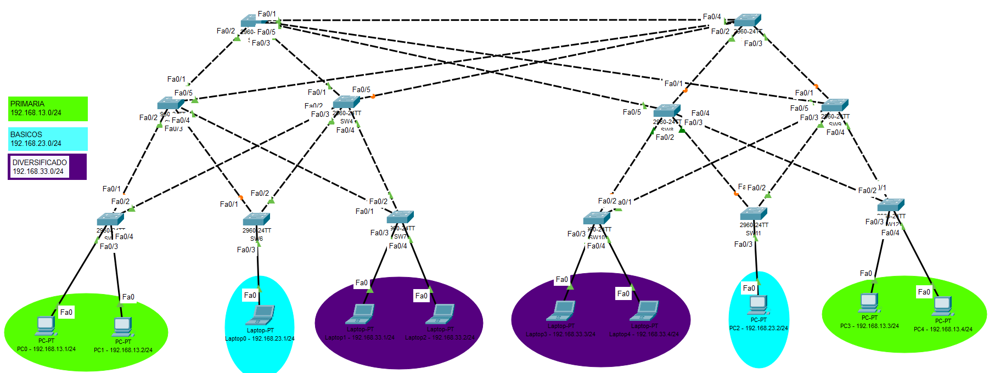
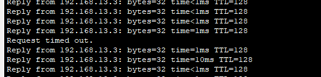

### **Universidad San Carlos de Guatemala**
### **Facultad de Ingeniería**
### **Escuela de Ciencias y Sistemas**
### **Redes de Computadoras 2**
### **Catedrático: Ing. Allan Alberto Morataya Gómez**
### **Auxiliar: Eduardo Ixén**

## **Manual Técnico - Práctica 1**

- **Estuardo Gabriel Son Mux – 202003894**
- **Angel Eduardo Marroquín Canizales – 202003959**
-----------
## Topología


## Configuration SW1 (Server)

```CMD
!--- Nombre del Hostname
hostname SW1_G21

!--- Configuracion password
enable secret redes2grupo21

line console 0
password redes2grupo21
login
exit

line vty 0 15
password redes2grupo21
login
exit

!--- Configuración de las interfaces troncales
int range fa0/1-5
switchport mode trunk 
switchport trunk allowed vlan 13,23,33
exit

!--- Creación de las VLAN
vlan 13
name PRIMARIA

vlan 23
name BASICOS

vlan 33
name DIVERSIFICADOS
exit

!--- Configuración de VTP
vtp version 2
vtp domain g21
vtp mode server

!--- Configuración Rapid-PSTP
spanning-tree mode rapid-pvst
spanning-tree vlan 1 root primary
spanning-tree vlan 13 root primary
spanning-tree vlan 23 root primary
spanning-tree vlan 33 root primary

do write
```

## Configuration SW2, SW3, SW8 y SW9

```CMD
!--- Nombre del Hostname
hostname SW#A_G21

!--- Configuración de las interfaces troncales
int range fa0/1-5
switchport mode trunk 
switchport trunk allowed vlan 13,23,33
exit

!--- Creación de las VLAN
vtp version 2
vtp domain g21
vtp mode client


!--- Configuración Rapid-PSTP
spanning-tree mode rapid-pvst
spanning-tree vlan 1
spanning-tree vlan 13
spanning-tree vlan 23
spanning-tree vlan 33

do write
```

#A: Hace referencia al numero del switch que se esta configurando, en este caso SW2, SW3, SW8 y SW9.

## Configuration SW5, SW7, SW10 y SW12

```CMD
!--- Nombre del Hostname
hostname SW#A_G21

!--- Configuración de las interfaces troncales
int range fa0/1-2
switchport mode trunk 
switchport trunk allowed vlan 13,23,33
exit

!--- Configuración de las interfaces de acceso
int range fa0/3-4
switchport mode access
switchport access vlan 33
exit

!--- Creación de las VLAN
vtp version 2
vtp domain g21
vtp mode client

!--- Configuración Rapid-PSTP
spanning-tree mode rapid-pvst
spanning-tree vlan 1
spanning-tree vlan 13
spanning-tree vlan 23
spanning-tree vlan 33

do write
```

#A: Hace referencia al numero del switch que se esta configurando, en este caso SW5, SW7, SW10 y SW12.

#V: Hace referencia al numero de la VLAN que se esta configurando, en este caso 13 para SW5 y 12; y 33 para vlan 7 y 10.

## Configuration SW6 y SW11

```CMD
!--- Nombre del Hostname
hostname SW#A_G21

!--- Configuración de las interfaces troncales
int range fa0/1-2
switchport mode trunk 
switchport trunk allowed vlan 13,23,33
exit

!--- Configuración de las interfaces de acceso
int range fa0/3
switchport mode access
switchport access vlan 23
exit

!--- Creación de las VLAN
vtp version 2
vtp domain g21
vtp mode client

!--- Configuración Rapid-PSTP
spanning-tree mode rapid-pvst
spanning-tree vlan 1
spanning-tree vlan 13
spanning-tree vlan 23
spanning-tree vlan 33

do write
```

#A: Hace referencia al numero del switch que se esta configurando, en este caso SW6 y SW11.

## Pruebas de convergencia STP

| Escenario | Protocolo Spanning-Tree | Red Primaria | Red Básicos | Red Diversificado |
| --- | --- | --- | --- | --- |
| 1 | PVST | 01:03.89 | 00:59.67 | 01:04.28 |
| 2 | Rapid PVST | 00:07.54 | 00:07.22 | 00:06.84 |

Modo elegido: **Rapid PSVT**

Se eligió este modo debido a que su tiempo de convergencia es con diferencia más rápido que el PSTV en cualquiera de las 3 vlan medidas, lo que a la hora de una falla en alguno de los enlaces activos, el tiempo que se necesitara para pasar a otros enlaces sera el minimo posible, siendo de gran beneficio tanto para el colegio como para los clientes, manteniendo de esta manera la mayor cantidad de eficiencia y disponibilidad de la red.

### **Prueba de eficiencia al usar PSVT**  


## Configuración de STP
```CMD
!--- Configuración Rapid-PSTP
spanning-tree mode rapid-pvst
spanning-tree vlan 1
spanning-tree vlan 13
spanning-tree vlan 23
spanning-tree vlan 33
```

## Desactivar DTP
Automaticamente al configurar el puerto en modo trunk, DTP se desactiva, sin embargo si se desea desactivar antes se puede usar la siguiente configuracion:
```CMD
!--- Desactivar DTP
interface fastEthernet 0/1
switchport nonegotiate
```

## Configuración de Seguridad para interfaces asignadas a la VLAN (MAC)

### SW5

```CMD
!--- Configuración de Seguridad de interfaces
interface fastEthernet 0/3
switchport port-security
switchport port-security mac-address 000A.4181.091D

interface fastEthernet 0/4
switchport port-security
switchport port-security mac-address 00E0.F782.65C4
```

### SW6

```CMD
!--- Configuración de Seguridad de interface
interface fastEthernet 0/3
switchport port-security
switchport port-security mac-address 00E0.A3C6.8895
```

### SW7

```CMD
!--- Configuración de Seguridad de interfaces
interface fastEthernet 0/3
switchport port-security
switchport port-security mac-address 0060.3E7E.C22B

interface fastEthernet 0/4
switchport port-security
switchport port-security mac-address 0006.2AD9.4B41 
```

### SW10

```CMD
!--- Configuración de Seguridad de interfaces
interface fastEthernet 0/3
switchport port-security
switchport port-security mac-address 0005.5E1D.471A

interface fastEthernet 0/4
switchport port-security
switchport port-security mac-address 0010.11EE.4A4A
```

### SW11

```CMD
!--- Configuración de Seguridad de interface
interface fastEthernet 0/3
switchport port-security
switchport port-security mac-address 00D0.974D.E0A5
```

### SW12

```CMD
!--- Configuración de Seguridad de interface
interface fastEthernet 0/3
switchport port-security
switchport port-security mac-address 00E0.B041.85C8

interface fastEthernet 0/4
switchport port-security
switchport port-security mac-address 0060.4704.CEB7
```


