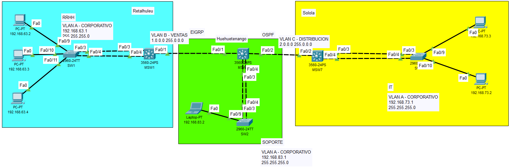

### **Universidad San Carlos de Guatemala**
### **Facultad de Ingeniería**
### **Escuela de Ciencias y Sistemas**
### **Redes de Computadoras 2**
### **Catedrático: Ing. Allan Alberto Morataya Gómez**
### **Auxiliar: Eduardo Ixén**

## **Manual Técnico - Práctica 2**

- **Estuardo Gabriel Son Mux – 202003894**
- **Angel Eduardo Marroquín Canizales – 202003959**
-----------
## Topología


## SW1
```CMD
enable
config t
hostname SW1

vlan 63
name corporativo63

interface range f0/3-4
no switchport access vlan 63
switchport mode trunk
switchport trunk allowed vlan 63,13
channel-group 1 mode active
no shutdown
exit

interface po1
no switchport access vlan 63
switchport mode trunk
switchport trunk allowed vlan 63,13

interface range f0/9-11
switchport mode access
switchpor access vlan 63
no shutdown

exit
```

## MSW1
```CMD
enable
config t
hostname MSW1

vlan 63
name corporativo63
vlan 13
name ventas13

interface f0/1
switchport trunk encapsulation dot1q
switchport mode trunk
switchport trunk allowed vlan 63,13
no shutdown

interface range f0/3-4
switchport trunk encapsulation dot1q
switchport mode trunk
switchport trunk allowed vlan 63,13
channel-group 1 mode active
no shutdown
exit

interface po1
switchport trunk encapsulation dot1q
switchport mode trunk
switchport trunk allowed vlan 63,13

interface vlan 63
ip address 192.168.63.1 255.255.255.0
no shutdown

interface vlan 13
ip address 1.0.0.1 255.0.0.0
no shutdown
exit

!--- Configuración EIGRP

ip routing
router eigrp 1
network 1.0.0.0
network 192.168.63.0
network 192.168.83.0
no auto-summary
```

## SW3
```CMD
enable
config t
hostname SW3

vlan 63
name corporativo63

interface range f0/3-4
switchport mode trunk
switchport trunk allowed vlan 23,63
channel-group 1 mode active
no shutdown
exit

interface po1
switchport mode trunk
switchport trunk allowed vlan 23,63

interface range f0/9-10
switchport mode access
switchport access vlan 63
no shutdown

exit
```

## MSW7
```CMD
enable
config t
hostname MSW7

vlan 63
name corporativo63
vlan 23
name distribucion23

interface range f0/3-4
switchport trunk encapsulation dot1q
switchport mode trunk
switchport trunk allowed vlan 23,63
channel-group 1 mode active
no shutdown
exit

interface f0/2
switchport trunk encapsulation dot1q
switchport mode trunk
switchport trunk allowed vlan 63,23
no shutdown

interface po1
switchport trunk encapsulation dot1q
switchport mode trunk
switchport trunk allowed vlan 23,63

interface vlan 63
ip address 192.168.73.1 255.255.255.0
no shutdown

interface vlan 23
ip address 2.0.0.2 255.0.0.0
no shutdown
exit

!--- Configuración OSPF

ip routing
router ospf 1
network 2.0.0.0 0.255.255.255 area 1
network 192.168.73.0 0.0.0.255 area 1
network 192.168.83.0 0.0.0.255 area 1
```

## SW2
```CMD
enable
config t
hostname SW2

vlan 63
name corporativo63

interface range f0/3-4
switchport mode trunk
switchport trunk allowed vlan 13,23,63
channel-group 1 mode active
no shutdown
exit

interface po1
switchport mode trunk
switchport trunk allowed vlan 13,23,63

interface f0/9
switchport mode access
switchport access vlan 63
no shutdown

exit
```

## MSW4
```CMD
enable
config t
hostname MSW4

vlan 63
name corporativo63
vlan 13
name ventas13
vlan 23
name distribucion23

interface range f0/3-4
switchport trunk allowed vlan 23,63
channel-group 1 mode active
no shutdown
exit

interface f0/1
switchport trunk encapsulation dot1q
switchport mode trunk
switchport trunk allowed vlan 63,13
no shutdown

interface f0/2
switchport trunk encapsulation dot1q
switchport mode trunk
switchport trunk allowed vlan 63,23
no shutdown

interface po1
switchport mode trunk
switchport trunk allowed vlan 13,23,63

interface vlan 63
ip address 192.168.83.1 255.255.255.0
no shutdown

interface vlan 13
ip address 1.0.0.2 255.0.0.0
no shutdown

interface vlan 23
ip address 2.0.0.1 255.0.0.0
no shutdown
exit

!--- Configuración OSPF

ip routing
router ospf 1
network 2.0.0.0 0.255.255.255 area 1
network 192.168.73.0 0.0.0.255 area 1
network 192.168.83.0 0.0.0.255 area 1

!--- Configuración EIGRP

router eigrp 1
network 1.0.0.0
network 192.168.63.0
network 192.168.83.0
no auto-summary
```

